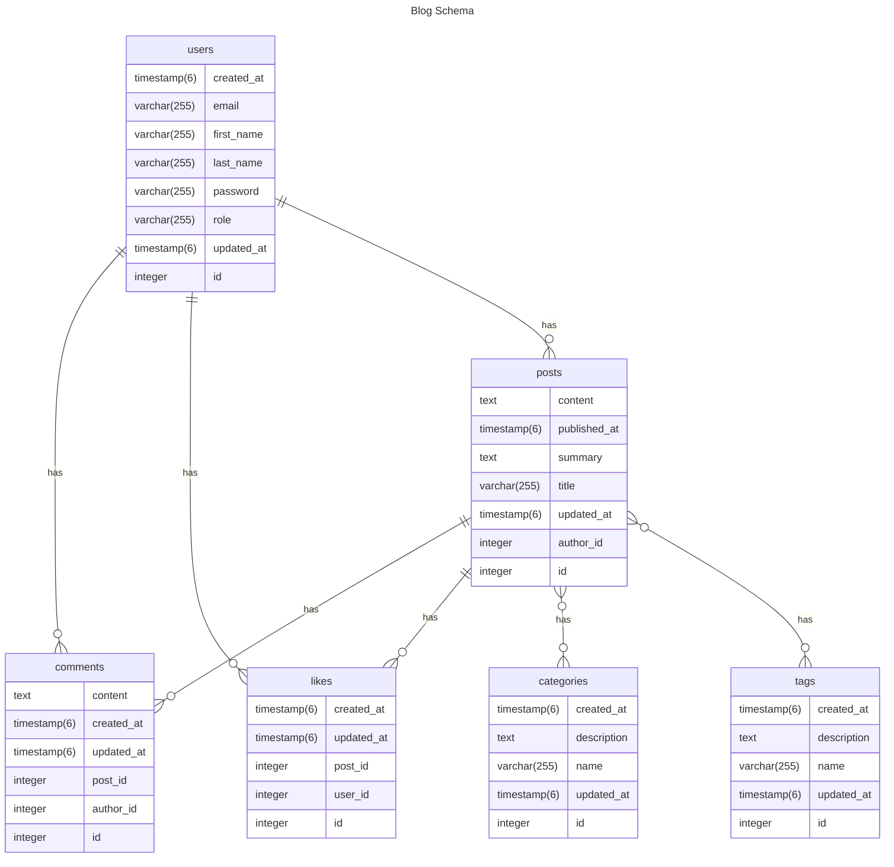

```mermaid
---
title: Blog Schema
---

erDiagram
categories {
timestamp(6) created_at
text description
varchar(255) name
timestamp(6) updated_at
integer id
}
comments {
text content
timestamp(6) created_at
timestamp(6) updated_at
integer post_id
integer author_id
integer id
}
likes {
timestamp(6) created_at
timestamp(6) updated_at
integer post_id
integer user_id
integer id
}
posts {
text content
timestamp(6) published_at
text summary
varchar(255) title
timestamp(6) updated_at
integer author_id
integer id
}
tags {
timestamp(6) created_at
text description
varchar(255) name
timestamp(6) updated_at
integer id
}
users {
timestamp(6) created_at
varchar(255) email
varchar(255) first_name
varchar(255) last_name
varchar(255) password
varchar(255) role
timestamp(6) updated_at
integer id
}

posts ||--o{ comments:has
posts ||--o{ likes:has
posts }o--o{ categories:has
posts }o--o{ tags:has
users ||--o{ comments:has
users ||--o{ likes:has
users ||-- o{ posts:has
```